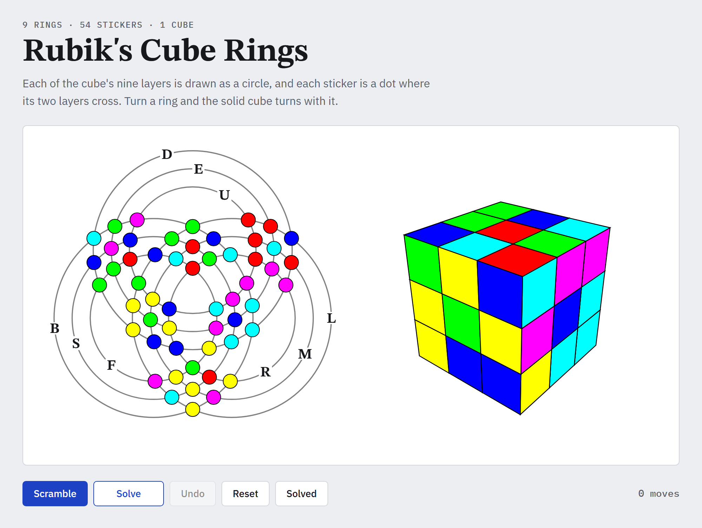

# Rubik's Cube Rings

A Rubik's cube you can play, drawn two ways at once. On the left, each of the cube's nine layers is a ring, and each sticker is a dot where its two layers cross. On the right is the same cube in perspective. Turn a ring and the solid cube turns with it.

Open `cube_rings.html` in a browser. There's nothing to install or build. Drag a dot along its ring or a square across the cube, click a ring or a face, or use the keys listed on the page. **Solve** finds a short solution with Kociemba's two-phase algorithm and plays it one move at a time.
